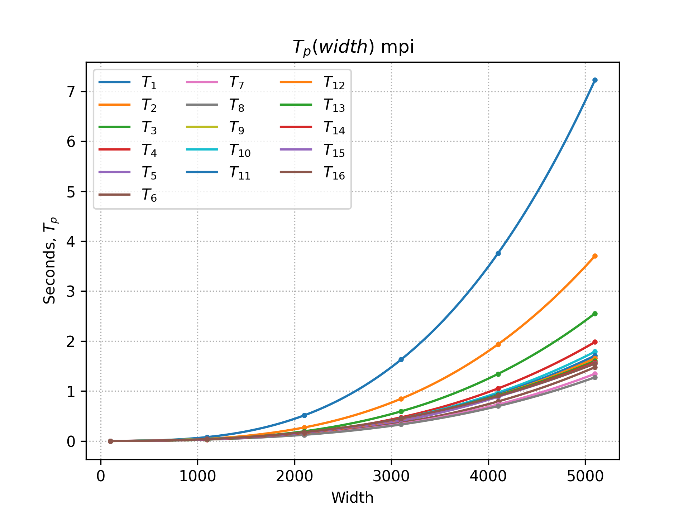
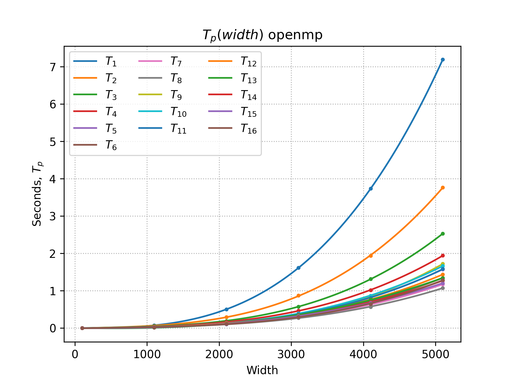
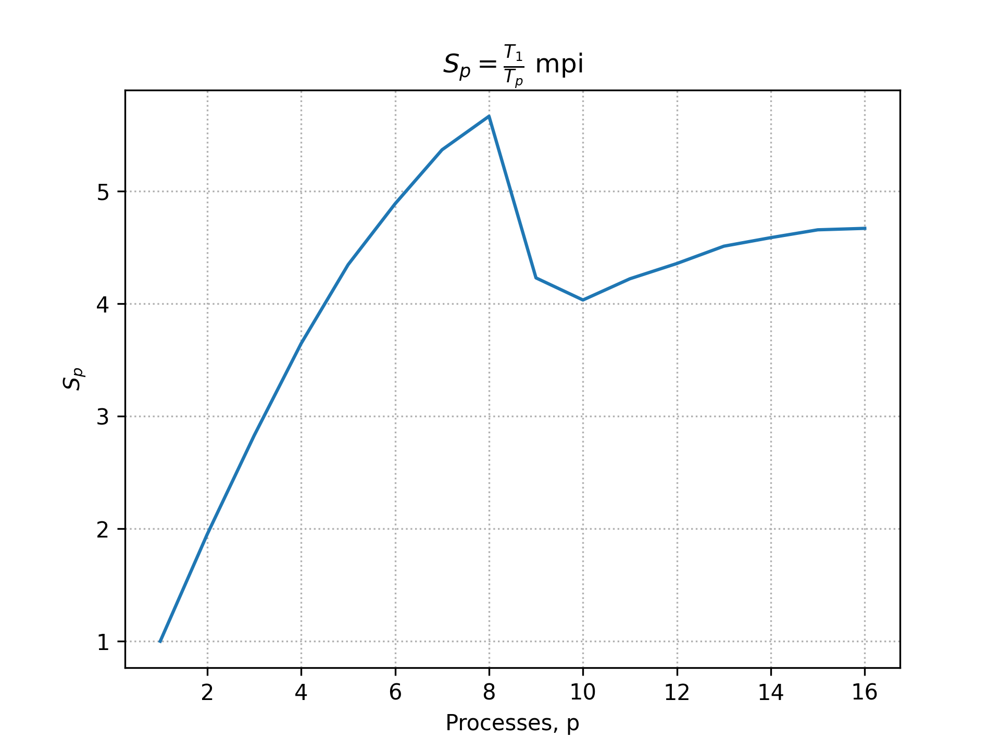
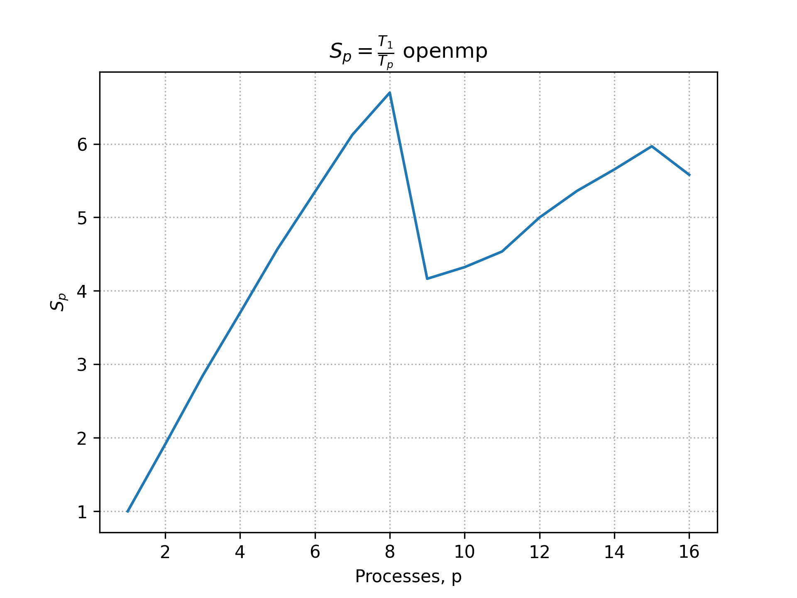

# boost-mpi-matr

Parallel matrix multiplication algorithm with
[Boost::mpi](https://www.boost.org/doc/libs/1_77_0/doc/html/mpi/tutorial.html)
and [Eigen3](https://eigen.tuxfamily.org/index.php?title=Main_Page).

## Build

```bash
$ mkdir build
$ cd build
$ cmake -GNinja .. -DCMAKE_BUILD_TYPE=Release
$ cmake --build .

# Alternative with meson:
$ meson setup build --buildtype release
$ cd build
$ meson compile
```

## Run single time

```bash
$ mpirun --oversubscribe -n 8 ./a 100
world.size() = 8
sendcounts = [1300, 1300, 1300, 1300, 1200, 1200, 1200, 1200]
displs = [0, 1300, 2600, 3900, 5200, 6400, 7600, 8800]
Process 1 recieved localA; shape = (13, 100)
Process 2 recieved localA; shape = (13, 100)
Process 3 recieved localA; shape = (13, 100)
Process 4 recieved localA; shape = (12, 100)
Process 5 recieved localA; shape = (12, 100)
Process 6 recieved localA; shape = (12, 100)
Process 7 recieved localA; shape = (12, 100)
Process 0 Scatterv matrix A
Process 0 recieved localA; shape = (13, 100)
Process 1 recieved matrix B
Process 1 calculating localR...
Process 2 recieved matrix B
Process 2 calculating localR...
Process 3 recieved matrix B
Process 3 calculating localR...
Process 4 recieved matrix B
Process 4 calculating localR...
Process 5 recieved matrix B
Process 5 calculating localR...
Process 6 recieved matrix B
Process 6 calculating localR...
Process 7 recieved matrix B
Process 7 calculating localR...
Process 0 Bcast matrix B
Process 0 recieved matrix B
Process 0 calculating localR...
Elapsed: 0.000613005 s
```

## Run multiple times and plot graphs

```bash
$ cd example
$ rm times-mpi.txt times-openmp.txt
$ ../multi-run.sh mpi ../build/main-mpi
$ python3 fit.py times-mpi.txt mpi
$ ../multi-run.sh openmp ../build/main-openmp
$ python3 fit.py times-openmp.txt openmp
```

## Example graphs








